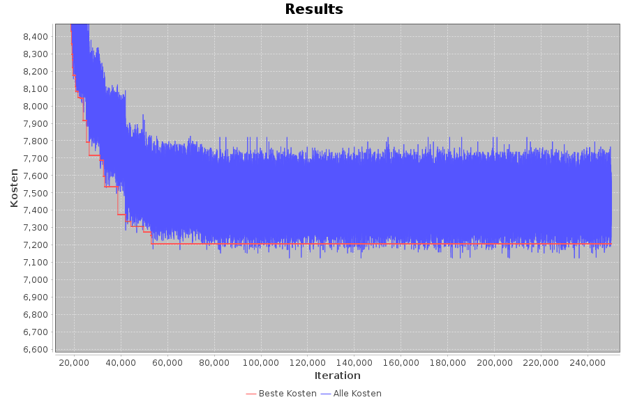
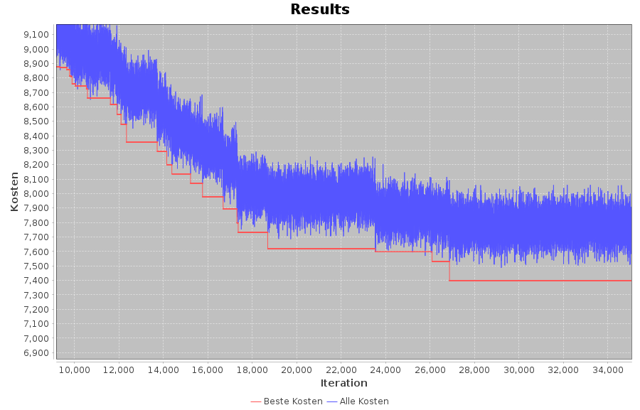
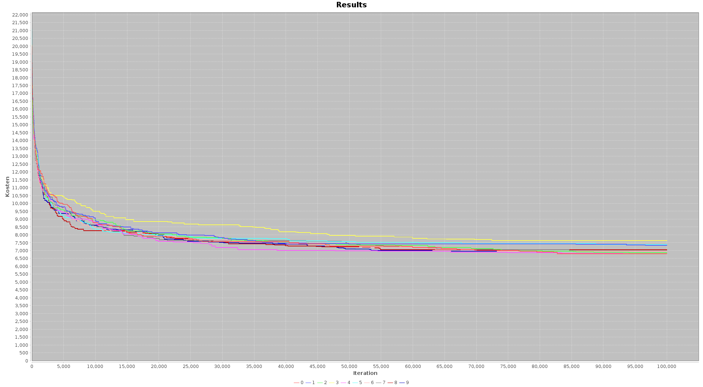
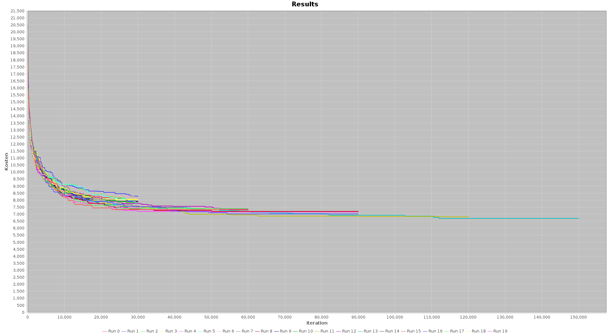

Dieses Agentensystem ist ein Projekt von Caroline Thies, David Schönberger und Max Guggenberger, erstellt im Rahmen einer Vorlesung an der DHBW 2021.
  
Das Ziel dieses Systems ist es, die Zahlen von 1 bis 200 in eine optimale Reihenfolge zu sortieren. Optimal bedeutet, die Kosten für diese Reihenfolge zu minimieren. Die Kosten werden von zwei Agenten mit unterschiedlichen Kostenmatrizen bestimmt. Diese definiert für jede Kombination aus zwei Zahlen zwischen 1 und 200 die Einzelkosten für diese Reihenfolge.
  
Die Agenten arbeiten egoistisch, versuchen also nur ihre eigenen Kosten zu minimieren. Die Kosten anderer Agenten sind für sie nicht relevant. 
  
Zusätzlich zu den Agenten verfügt das System über einen sogenannten Mediator. Dieser generiert mögliche Lösungen und stellt diese nacheinander den Agenten vor. Die Agenten beantworten jeden Vorschlag entweder mit Zustimmung oder Ablehnung, abhängig davon, ob der Vorschlag für sie selbst günstiger war als der letzte. Sie teilen dem Mediator aber zu keinem Zeitpunkt ihre tatsächlichen Kosten mit.
  
Der Mediator beginnt die Verhandlung mit einer zufälligen Reihenfolge. Der erste Vorschlag muss von allen Agenten akzeptiert werden, da kein Besserer vorliegt. Aus dieser Lösung generiert der Mediator Mutationen, indem er zwei zufällige Zahlen vertauscht. Findet er eine Mutation, der beide Agenten zustimmen, speichert er diese. Anschließend generiert er aus dieser Lösung neue Mutationen und beginnt das Spiel von vorne. Dies wird wiederholt, bis eine zu Beginn festgelegte Anzahl an Iterationen erreicht ist. Der Mediator gibt dann die bis dahin beste gefundene Lösung aus.

Die folgende Abbildung zeigt, wie sich mit diesem Ansatz die Gesamtkosten im Laufe der Verhandlung verändern. Die rote Linie zeigt die jeweils besten akzeptierten Kosten zu jeder Iteration, in blau sind die Kosten jedes einzelnen Vorschlags dargestellt. Wie man leicht sieht, wird es mit zunehmender Verhandlungsdauer schwieriger, bessere Lösungen zu finden.

In der folgenden Abbildung ist ein vergrößerter Abschnitt einer solchen Kostenentwicklung dargestellt. Dabei zeigt sich, dass die blaue Linie immer wieder unter der roten Linie liegt. Das lässt sich so interpretieren, dass der Mediator einen Vorschlag generiert hat, der niedrigere Gesamtkosten verursacht als das bisher "beste" Ergebnis. Dieser Vorschlag wurde aber nicht akzeptiert, da er für einen Agenten die Kosten erhöht hat. Der Egoismus der Agenten führt also dazu, dass bessere Lösungen verworfen werden müssen.

Das ist ein bekanntes Problem solcher Agentensysteme. Ein häufiger Lösungsansatz ist es, den Agenten eine gewisse Mindestakzeptanzrate vorzuschreiben, damit sie gelegentlich leichte Verschlechterungen in Kauf nehmen. Das erfordert für gewöhlich komplexe stochastische Berechnungen auf Seite der Agenten und birgt die Gefahr einer Gesamtverschlechterung, wenn beide Agenten zur selben Zeit beschließen, einen leicht schlechteren Vertrag zu akzeptieren. Dieses Projekt geht einen anderen Weg, der es den Agenten weiterhin ermöglicht, ausschließlich Verbesserungen zu akzeptieren - indem die Agenten miteinander handeln können.
  
Akzeptiert ein Agent einen Vertrag, teilt er dem Mediator zusätzlich eine Zahl mit. Diesen Wert ist er bereit dem anderen Agenten zu bezahlen, damit dieser den Vertrag ebenfalls akzeptiert und wird im Folgenden auch als "Geld" bezeichnet. Lehnt ein Agent einen Vorschlag ab, sagt er dem Mediator, welcher Wert seine Meinung ändern könnte. Der Mediator hat nun die Aufgabe, daraus eine abschließende Entscheidung zu errechnen. Im einfachsten Fall stimmen alle Agenten zu, dann ändert sich nichts. Lehnen beide ab oder wird weniger Geld geboten als gefordert, ist der Vorschlag abgelehnt. Wenn aber gleich viel oder sogar mehr Geld geboten wird als insgesamt gefordert, ist eine Einigung möglich und der Vertrag wird akzeptiert. Der Mediator errechnet zusätzlich für jeden Agenten ein Delta, um das dieser seine eigenen Kosten für diesen Vorschlag anpassen muss: Hat er Geld gezahlt, steigen seine Kosten um den entsprechenden Wert. Hat er Geld erhalten, sinken seine Kosten um den entsprechenden Wert.
  
Solange sie weniger Geld zahlen, als sie durch den neuen Vorschlag an Kosten einsparen, bzw. mehr Geld verlangen, als sie an Kosten dazugewinnen, steht dieser Ansatz nicht im Konflikt mit egoistischem Handeln. Ganz im Gegenteil gibt es den Agenten ein Mittel, ihre eigenen Interessen durchzusetzen - aber ohne den Gesamtkosten oder auch nur den Interessen anderer Agenten Schaden zuzufügen. Die folgende Abbildung zeigt erneut einen vergrößerten Abschnitt einer Kostenentwicklung, diesmal mit den beschriebenen Transaktionen:

Wie man leicht sieht, sinken die Gesamtkosten nun deutlich schneller. Beinahe jede Verbesserung der Gesamtkosten wird von beiden Agenten akzeptiert, da diese durch Transaktionen beide von der Verbesserung profitieren können. Noch immer werden gelegentlich Gesamtverbesserungen abgeleht, aber das lässt sich bei dieser Bilanz gut verschmerzen.
  
Denn dieser Mechanismus hat gegenüber dem reinen Zustimmen oder Ablehnen noch einen ganz anderen Vorteil: Er lässt sich problemlos skalieren. Müssen nicht nur zwei, sondern fünf, zwanzig oder hunderte Agenten verhandeln, wird es schnell schwierig für alle eine Verbesserung zu finden. Können aber angebotenes und gefordertes Geld aufsummiert und verglichen werden, kann deutlich leichter eine für alle Agenten positive Einigung erreicht werden.

Aber es geht noch besser. Die folgende Abbildung zeigt die Entwicklung der besten Gesamtkosten in mehreren unabhängigen Durchläufen:

Wie man leicht sieht, schwanken die Ergebnisse stark. Für ein besseres Ergebnis könnte man also immer mehrer Runs simulieren und zuletzt den besten Vorschlag des besten Runs zurückgeben. Zudem sieht es danach aus, als wären Runs mit schlechteren Endergebnissen oft schon früher schlechter als Runs mit besseren Endergebnissen. Es wäre also naheliegend, solche schlechten Runs früher zu terminieren, um Rechenzeit zu sparen. Dabei darf man aber eine wichtige Grundregel des Systems nicht vergessen: Der Mediator weiß nicht, welcher Vorschlag welche Kosten verursacht, weder insgesamt noch pro Agent. Wie soll er also einen "besten" Run ermittlen?
  
Dieses Problem lässt sich mit einer einfachen Überlegung umgehen. Die Agenten können bereits zwei einzelne Vorschläge miteinander vergleichen. Und ein Vergleich ist alles, was für eine Sortierung erforderlich ist. Der Mediator kann also die Agenten bitten, die besten Vorschläge der einzelnen Runs nach Kosten zu sortieren. Aus diesen Sortierungen kann er dann eine durchschnittliche Bewertung pro Run errechnen und diese so in eine Gesamtreihenfolge bringen. Die folgende Abbildung zeigt die Simulation mehrerer Runs, in der alle 30.000 Iterationen die schlechtere Hälfte terminiert wurde:
