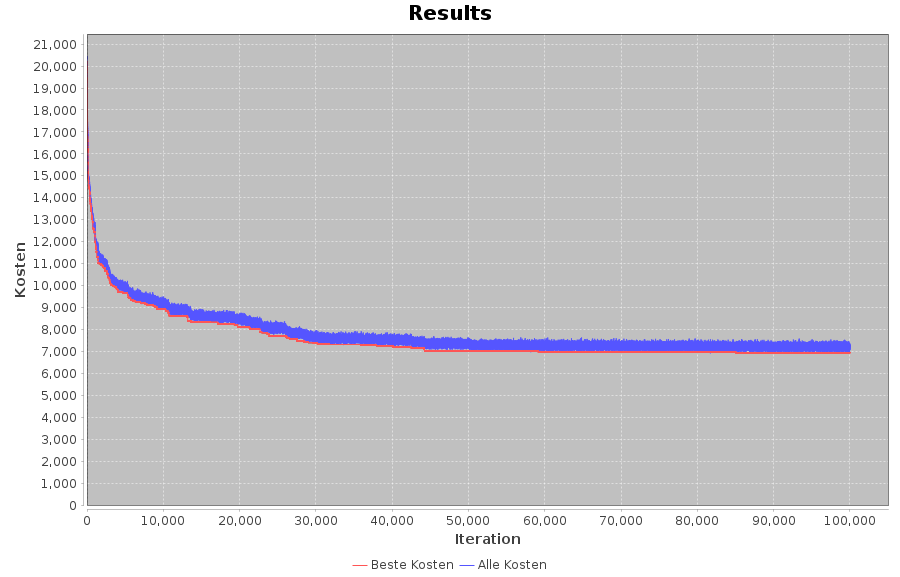

Dieses Agentensystem ist ein Projekt von Caroline Thies, David Schönberger und Max Guggenberger, erstellt im Rahmen einer Vorlesung an der DHBW 2021.
  
Das Ziel dieses Systems ist es, die Zahlen von 1 bis 200 in eine optimale Reihenfolge zu sortieren. Optimal bedeutet, die Kosten für diese Reihenfolge zu minimieren. Die Kosten werden von zwei Agenten mit unterschiedlichen Kostenmatrizen bestimmt. Diese definiert für jede Kombination aus zwei Zahlen zwischen 1 und 200 die Einzelkosten für diese Reihenfolge.
  
Die Agenten arbeiten egoistisch, versuchen also nur ihre eigenen Kosten zu minimieren. Die Kosten anderer Agenten sind für sie nicht relevant. 
  
Zusätzlich zu den Agenten verfügt das System über einen sogenannten Mediator. Dieser generiert mögliche Lösungen und stellt diese nacheinander den Agenten vor. Die Agenten beantworten jeden Vorschlag entweder mit Zustimmung oder Ablehnung, abhängig davon, ob der Vorschlag für sie selbst günstiger war als der letzte. Sie teilen dem Mediator aber zu keinem Zeitpunkt ihre tatsächlichen Kosten mit.
  
Der Mediator beginnt die Verhandlung mit einer zufälligen Reihenfolge. Der erste Vorschlag muss von allen Agenten akzeptiert werden, da kein Besserer vorliegt. Aus dieser Lösung generiert der Mediator Mutationen, indem er zwei zufällige Zahlen vertauscht. Findet er eine Mutation, der beide Agenten zustimmen, speichert er diese. Anschließend generiert er aus dieser Lösung neue Mutationen und beginnt das Spiel von vorne. Dies wird wiederholt, bis eine zu Beginn festgelegte Anzahl an Iterationen erreicht ist. Der Mediator gibt dann die bis dahin beste gefundene Lösung aus.

Die folgende Abbildung zeigt, wie sich mit diesem Ansatz die Gesamtkosten im Laufe der Verhandlung verändern. Die rote Linie zeigt die jeweils besten akzeptierten Kosten zu jeder Iteration, in blau sind die Kosten jedes einzelnen Vorschlags dargestellt. Wie man leicht sieht, wird es mit zunehmender Verhandlungsdauer schwieriger, bessere Lösungen zu finden.

In der folgenden Abbildung ist ein vergrößerter Abschnitt einer solchen Kostenentwicklung dargestellt. Dabei zeigt sich, dass die blaue Linie immer wieder unter der roten Linie liegt. Das lässt sich so interpretieren, dass der Mediator einen Vorschlag generiert hat, der niedrigere Gesamtkosten verursacht als das bisher "beste" Ergebnis. Dieser Vorschlag wurde aber nicht akzeptiert, da er für einen Agenten die Kosten erhöht hat. Der Egoismus der Agenten führt also dazu, dass bessere Lösungen verworfen werden müssen.
